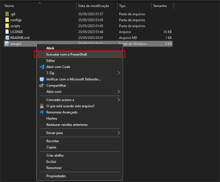

# inatel-setup
Powershell Script desenvolvido para configurar quase automaticamente o que for necessário no notebook usado em sala na instituição Inatel

# Run
## Comando de uma linha
Abra o PowerShell e execute o comando abaixo:
```
Set-Location $env:USERPROFILE\Desktop; git clone https://github.com/YamSol/inatel-setup.git; Set-Location inatel-setup; powershell.exe -ExecutionPolicy Bypass -File ".\run.ps1"
```
## Passo a Passo
Para executar o script, siga os seguintes passos:
1. Clonar o repositório:
   ```
   git clone https://github.com/YamSol/inatel-setup.git ~/Downloads
   ```
2. Abra a pasta do repositório:
3. Com o botão direito no arquivo `run.ps1`, vá em `Executar com o PowerShell`
   
   
